[README.md](https://github.com/user-attachments/files/31612020/README.md)
# 하이브리드 클라우드 Active-Active 인프라 보안 프로젝트 — 담당 파트

> 4인 팀 프로젝트(2026.06.30 ~ 2026.07.31) 중 **본인이 직접 설계·구축한 영역**만 정리한 문서입니다.
> 전체 프로젝트는 AWS/온프레미스 하이브리드 클라우드 Active-Active 인프라를 구축하는 것이었고,
> 이 저장소는 그중 **AWS 네트워크, VPN 연동, Suricata IDS, Security Zone 중앙 관제, ELK/Kibana 로그 파이프라인**을 다룹니다.

## 담당 역할

| 영역 | 내용 |
|---|---|
| AWS 네트워크 설계 | VPC, Subnet(Public/Private), Internet Gateway, NAT Gateway, ALB 연동 구조 설계 |
| VPN 연동 | AWS Transit Gateway ↔ 온프레미스(GNS3) 간 Site-to-Site VPN 구성 |
| IDS 구축 | 온프레미스 Suricata(Passive IDS) 구축 및 SPAN 미러링 기반 탐지 |
| Security Zone 중앙 관제 | AWS/온프레미스 로그를 수집하는 독립 Security Zone(Logstash/Elasticsearch/Kibana) 네트워크 설계 |
| 로그 파이프라인 | Filebeat/Elastic Agent → Logstash(mTLS) → Elasticsearch → Kibana 통합 대시보드 |

## 전체 아키텍처

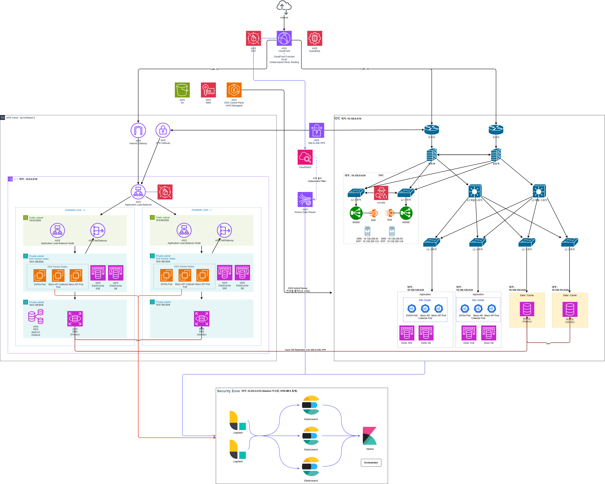

AWS(서울 리전) ↔ Site-to-Site VPN ↔ 온프레미스(IDC) ↔ Security Zone(독립 관제 구간) 3구간 구조입니다.

---

## 1. AWS 네트워크 설계

Terraform으로 AWS 서울 리전(ap-northeast-2)에 VPC부터 TGW/VPN까지 순서대로 프로비저닝했습니다.

### VPC

| 항목 | 내용 |
|---|---|
| 리소스 명 | seoul-vpc-main |
| CIDR 블록 | 10.12.0.0/16 |
| AZ 수 | 2개 (ap-northeast-2a, ap-northeast-2c) |

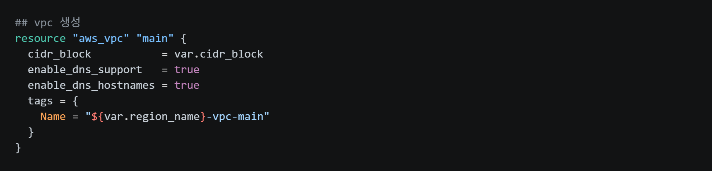
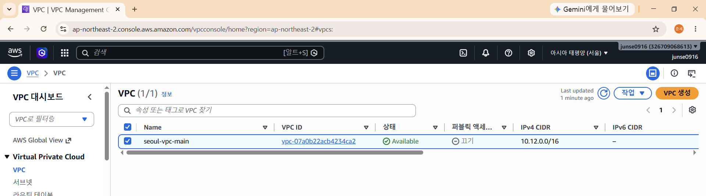

### Subnet 구성

**Public Subnet (2개)** — ALB, NAT Gateway 배치

| 이름 | AZ | CIDR |
|---|---|---|
| public-subnet-iac01-1 | ap-northeast-2a | 10.12.0.0/24 |
| public-subnet-iac01-2 | ap-northeast-2c | 10.12.0.10/24 |

**Private Subnet (4개)** — EKS Worker Node 2개 + RDS/Cache 2개

| 이름 | AZ | CIDR | 구성요소 |
|---|---|---|---|
| private-subnet-eks-iac01-1 | 2a | 10.12.16.0/24 | EKS worker node, TGW attachment |
| private-subnet-eks-iac01-2 | 2c | 10.12.17.0/24 | EKS worker node, TGW attachment |
| private-subnet-rds-iac01-1 | 2a | 10.12.32.0/24 | RDS(MariaDB), ElastiCache, S3 Gateway Endpoint |
| private-subnet-rds-iac01-2 | 2c | 10.12.33.0/24 | RDS(MariaDB), ElastiCache, S3 Gateway Endpoint |

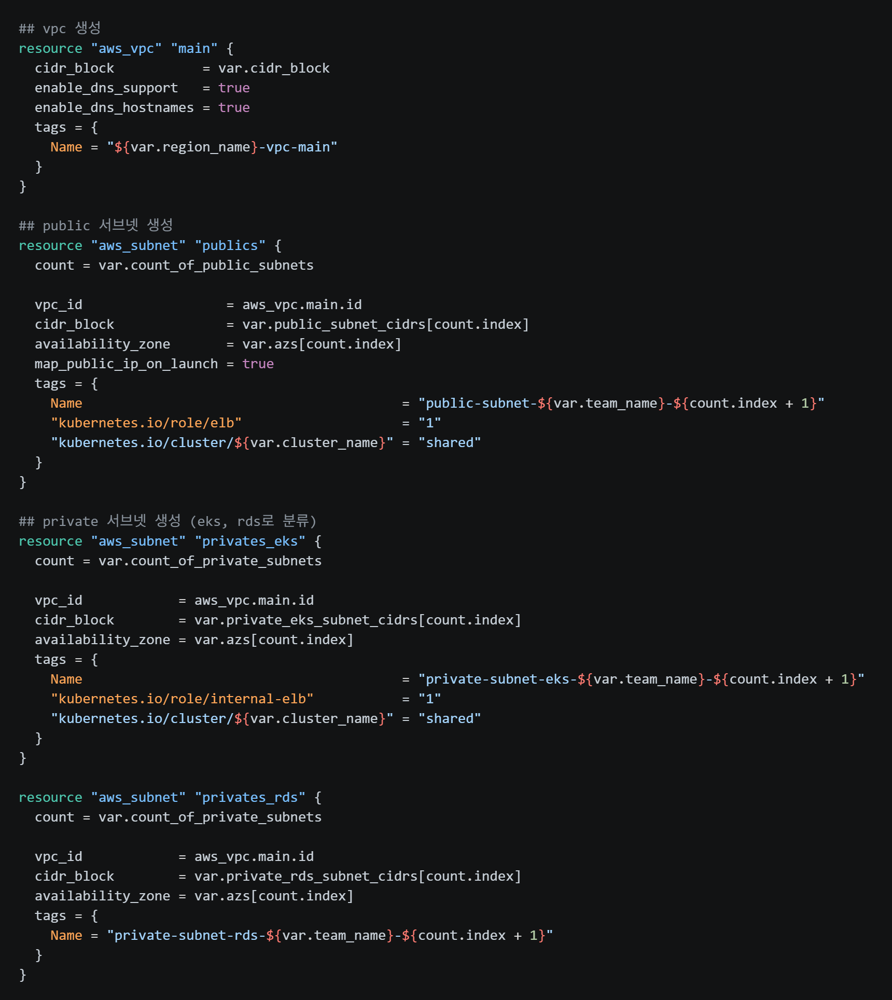
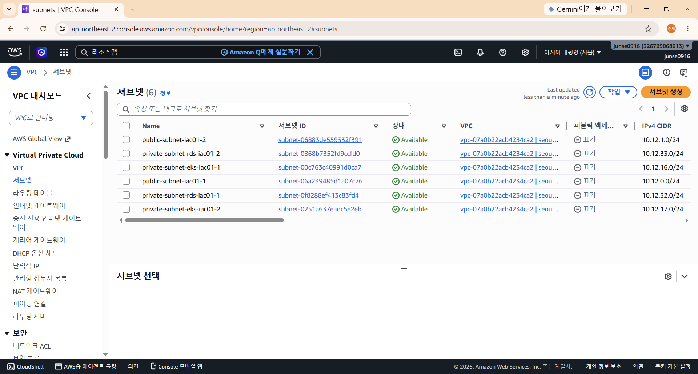

### Internet Gateway / NAT Gateway

| 항목 | 내용 |
|---|---|
| IGW | seoul-igw-main-iac01 (Public Subnet 인터넷 인/아웃바운드 경로) |
| NAT Gateway | nat-gw-iac01-1 / nat-gw-iac01-2 (AZ별 1개씩, 총 2개) |

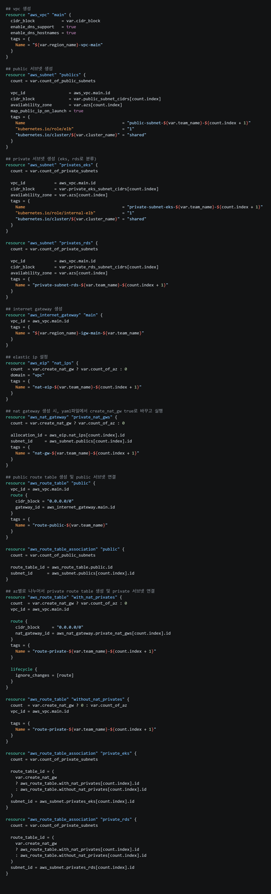
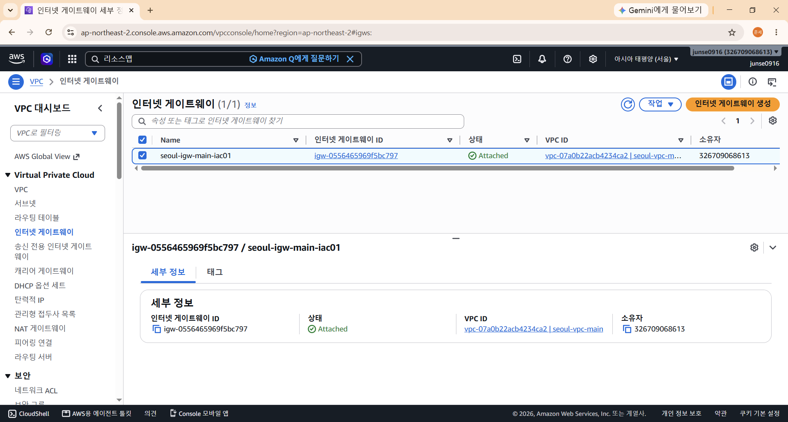
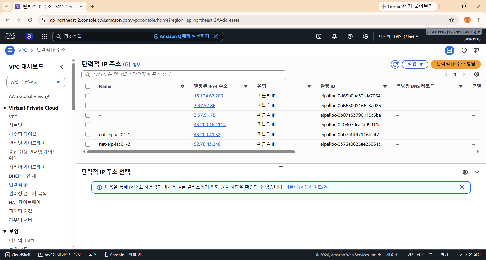
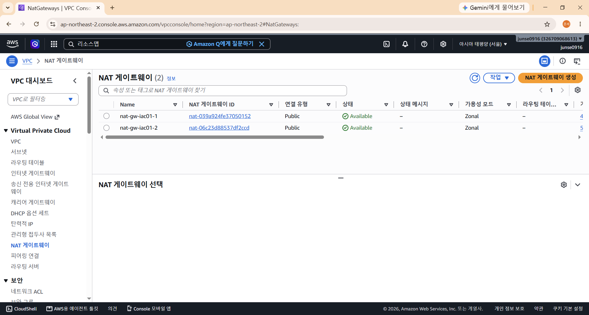

### Route Table (총 3개)

| 항목 | route-public-iac01 | route-private-iac01-1 | route-private-iac01-2 |
|---|---|---|---|
| 연결 서브넷 | public-subnet-iac01-1/2 | private-eks-1, private-rds-1 | private-eks-2, private-rds-2 |
| 기본 라우팅(0.0.0.0/0) | → seoul-igw-main-iac01 | → nat-gw-iac01-1 | → nat-gw-iac01-2 |
| 추가 라우팅 | - | 10.128.0.0/16(온프레미스), 10.244.0.0/16(Pod CIDR), 10.255.0.0/16(Security Zone) → TGW / S3 Endpoint | 동일 |

### Transit Gateway

| 항목 | 내용 |
|---|---|
| 리소스 명 | seoul-tgw-main |
| ASN | 64512 |
| ECMP | 지원 |
| VPC Attachment | private-subnet-eks-iac01-1/2 |
| TGW 라우팅테이블 | seoul-tgw-rt-idc, seoul-tgw-rt-security-zone |

### Security Group

| SG 이름 | 방향 | 서비스 | 포트 | 대상 |
|---|---|---|---|---|
| fw-icmp-iac01 | ingress | ICMP echo | type 8 | 0.0.0.0/0 |
| fw-out-iac01 | egress | 전체 아웃바운드 | -1 | 0.0.0.0/0 |
| fw-lb-iac01 | ingress | http/https/icmp | 80, 443, type 8 | 0.0.0.0/0 |
| fw-eks_worker-iac01 | ingress/egress | from_alb / icmp | 80, 8080, type 8 | SG 참조 |
| fw-rds-iac01 | ingress | mysql | 3306 | 10.12.16-17.0/24, 10.128.32-33.0/24, 10.255.0.0/24 |
| fw-log_pipeline-iac01 | ingress | https | 443 | 10.255.0.0/16 (Kinesis/CloudWatch Endpoint) |
| fw-resolver_inbound-iac01 | ingress | dns_udp/tcp | 53 | 10.255.0.0/16 (Route53 Resolver) |

> 전체 Security Group 목록은 팀 보고서 원본을 참고하세요. 위 표는 네트워크·로그 파이프라인과 직접 관련된 항목만 발췌했습니다.

---

## 2. VPN 연동 (AWS ↔ 온프레미스)

| 항목 | R1 | R2 | Security |
|---|---|---|---|
| ASN | 65001 | 65002 | 65003 |
| 용도 | IDC | IDC | Security Zone |
| 대상 Public IP | 183.98.32.210 (Lab 환경 제약으로 3개 CGW가 공인 IP 1개를 공유, ASN으로 구분) | | |

### 연결 검증

온프레미스 IDC의 R1/R2와 Security Zone R1이 동일한 방식(Customer Gateway + Site-to-Site VPN)으로 연결되므로, Security Zone R1의 설정 과정을 대표로 검증했습니다.

- `show crypto isakmp sa`: IPsec VPN 터널의 1단계 협상 상태 확인
- `show ip bgp summary`: BGP 세션 상태 및 실제 교환된 라우트 개수 확인 — State/PfxRcd 항목에 숫자가 표시되면 BGP 세션이 정상적으로 Established되었다는 의미

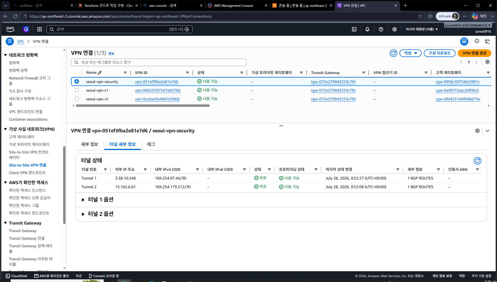

AWS 콘솔에서 VPN 터널 상태가 모두 UP인 것을 확인했습니다.

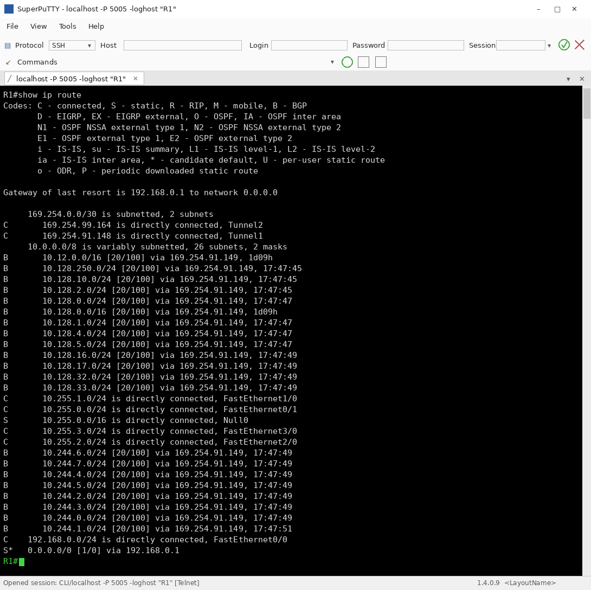

Security Zone의 R1이 자기 대역뿐 아니라 AWS VPC 대역(10.12.0.0/16), 온프레미스 각 Zone 대역, Kubernetes Pod 대역까지 전부 BGP(B)로 학습되어 있음을 확인했습니다.

---

## 3. 온프레미스 네트워크 & Suricata IDS

GNS3로 R1/R2(Edge Gateway) → FW1/FW2 → SW1/SW2(L3 Core) → DMZ/App/Data VLAN 순으로 구성했습니다.

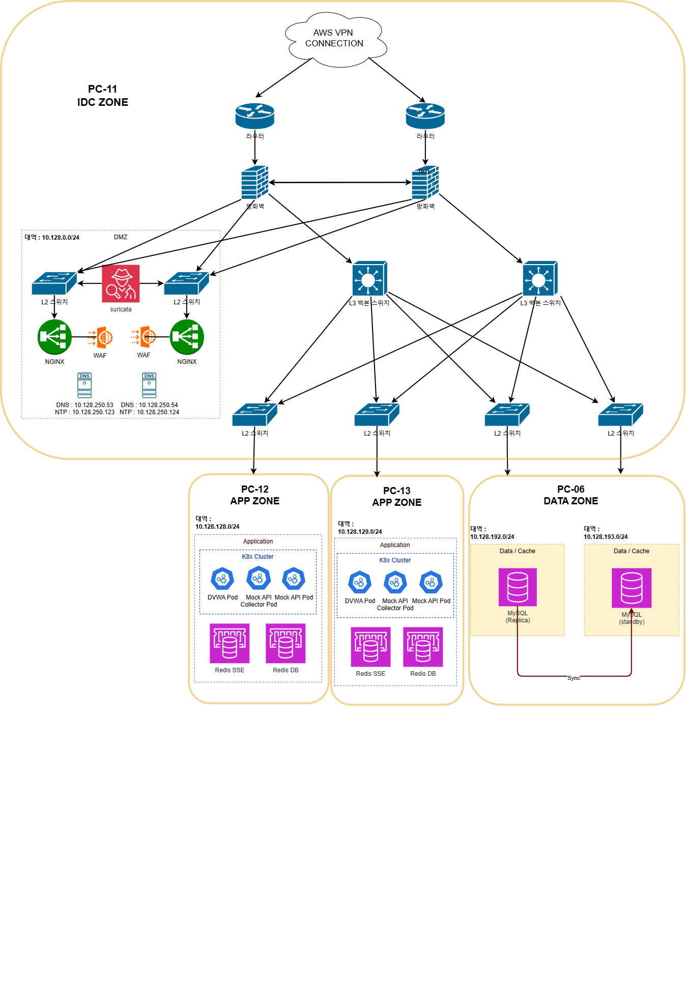
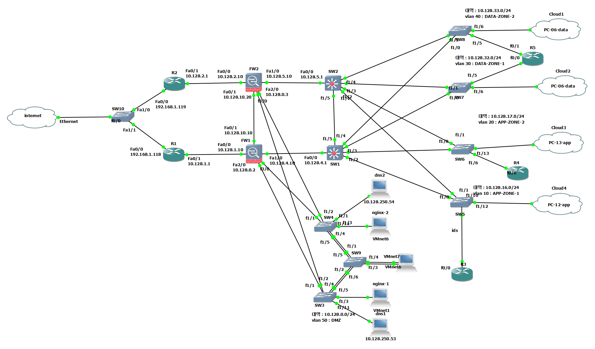

### Suricata 배치

| 서버 | 역할 | IP |
|---|---|---|
| suricata-1 | Passive IDS (SW9 SPAN 미러링 기반) | 10.128.0.21 |

- **탐지 방식**: 전용 SPAN 스위치(SW9)로 트래픽을 미러링받아 수동적으로(Passive) 탐지
- **로그 전달**: Filebeat/Elastic Agent가 `eve.json`을 수집하여 Logstash(5044/mTLS)로 전송

### 설치 과정

1. epel 저장소를 추가하고 suricata 패키지 설치
2. `/var/lib/suricata/rules/suricata.rules`에 탐지 룰셋 추가 후 서비스 구동
3. 로그가 정상적으로 쌓이는지 확인하여 동작 검증
4. 미러링 포트로 사용할 NIC를 promiscuous 모드로 설정 (SPAN 트래픽 수신을 위해 필요)

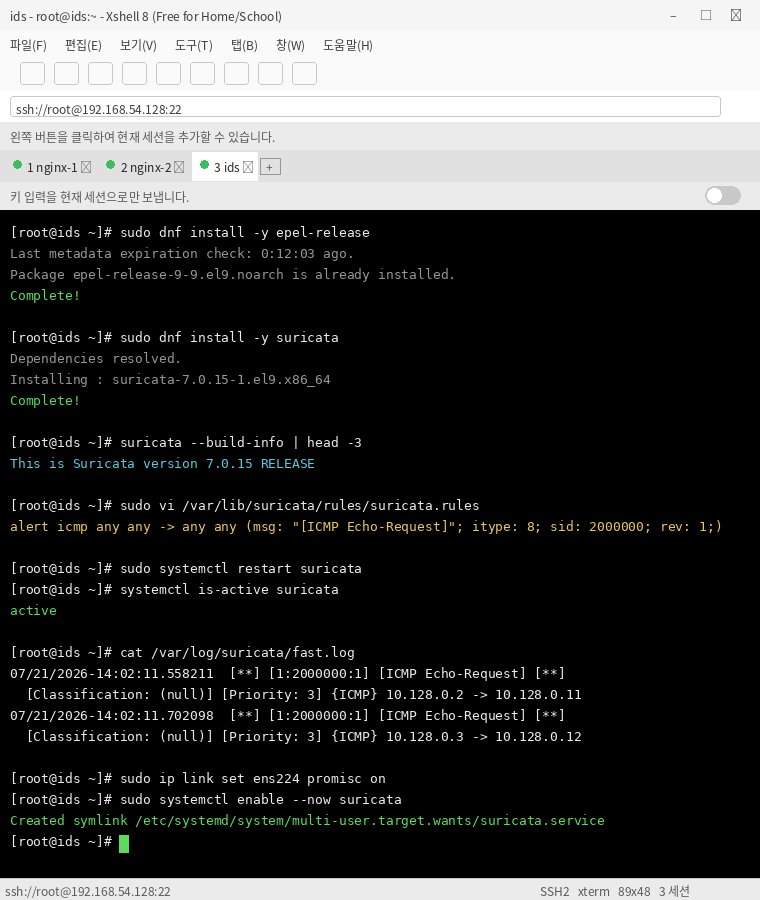

---

## 4. Security Zone 중앙 관제

AWS/온프레미스와 직접 연결되지 않는 **독립 routing domain**으로 구성하고, Logstash/Elasticsearch/Kibana/Orchestrator를 배치했습니다.

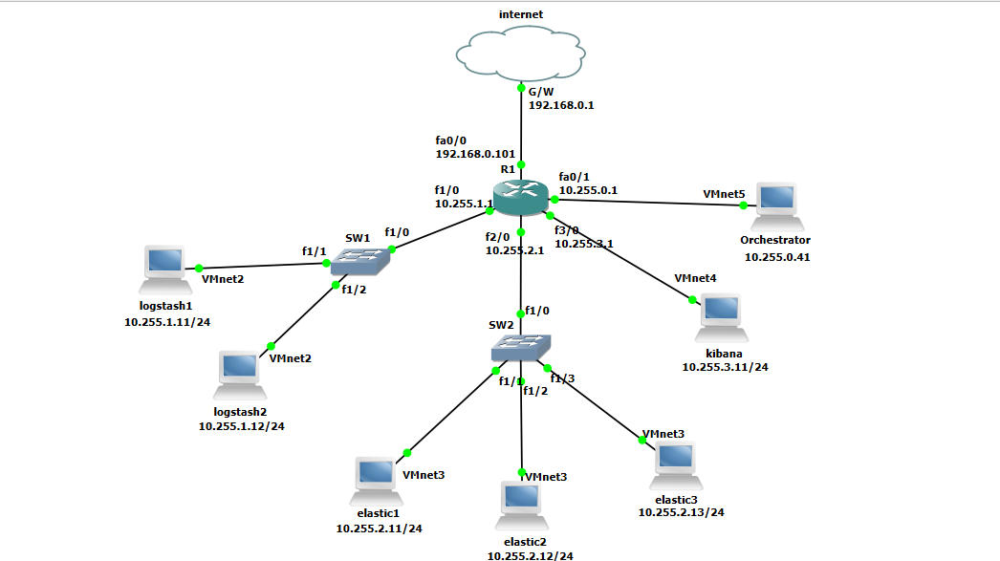

### 서버 구성

| 서버 | 역할 | IP |
|---|---|---|
| logstash1/2 | 로그 파이프라인 (2대 이중화) | 10.255.1.11 / 12 |
| elastic1/2/3 | Elasticsearch 클러스터 (3노드) | 10.255.2.11 / 12 / 13 |
| kibana | 통합 대시보드 | 10.255.3.11 |
| Orchestrator1 | DB Failover 자동화 도구 (타 팀원 담당 영역) | 10.255.0.41 |

### 계층 분리 설계

수집(Logstash) · 저장(Elasticsearch) · 조회(Kibana) 계층을 각각 다른 VMnet(대역)으로 분리하여, **한 계층이 침해되어도 다른 계층에 직접 접근할 수 없도록** 설계했습니다.

| VMnet | 용도 | 대역 |
|---|---|---|
| VMnet2 | Logstash | 10.255.1.0/24 |
| VMnet3 | Elasticsearch | 10.255.2.0/24 |
| VMnet4 | Kibana | 10.255.3.0/24 |
| VMnet5 | Orchestrator | 10.255.0.0/24 |

---

## 5. ELK 로그 파이프라인 & Kibana 대시보드

| 구성요소 | 설정 내용 |
|---|---|
| Elasticsearch | 3노드 클러스터, `cluster.name`/`discovery.seed_hosts` 설정 |
| Logstash | 2대 이중화, Beats input(5044/TLS, mTLS) + Kinesis input |
| Kibana | 통합 대시보드, elastic1/2/3 클러스터에 연결 |
| 인덱스 정책 | `logs-waf-*`, `logs-suricata-*` 등 로그 유형별 인덱스, ILM 보관정책 적용 |

### 수집 대상

| 소스 | 경로 |
|---|---|
| AWS (WAF/RDS/ElastiCache) | CloudWatch → Kinesis 경유 시 gzip 데이터 손상 문제가 있어, **Kinesis를 거치지 않고 Logstash가 VPC Interface Endpoint로 CloudWatch Logs를 직접 폴링** |
| AWS (GuardDuty/Backup) | EventBridge → Kinesis → Security Zone Logstash가 전용 IAM으로 직접 pull |
| 온프레미스 (NGINX, Suricata) | Filebeat/Elastic Agent → Logstash(5044/**mTLS**) |

> CloudTrail/VPC Flow Logs 원본은 Kinesis로 보내지 않았습니다. GuardDuty가 이미 이 데이터를 분석해 Finding으로 가공한 뒤 Kinesis로 전달하므로, 원본까지 중복 전송하면 낭비라고 판단해 Kibana 실시간 대시보드는 GuardDuty Finding 중심으로 구성했습니다.

### Elasticsearch / Kibana / Logstash 설치

- **Elasticsearch**: elastic1(초기 hostname: els1)에서 최초 설치 및 클러스터 초기화 → elastic2/3는 elastic1이 발급한 enrollment token으로 재설치 없이 클러스터 합류
- **Kibana**: els1에서 발급받은 토큰으로 클러스터 연결, 5601 포트 개방
- **Logstash**: 2대 이중화(log1/log2) 설치, Beats input(5044) 및 파이프라인 문법 검증 후 실제 로그 파싱 확인

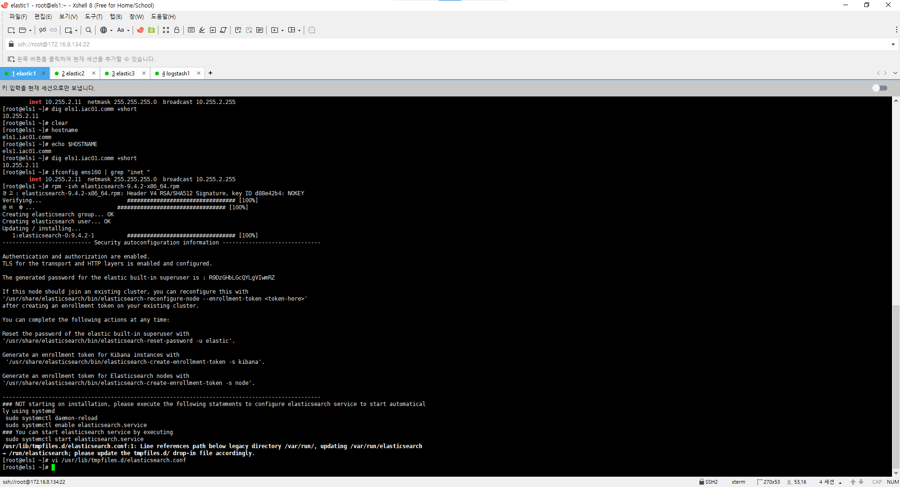
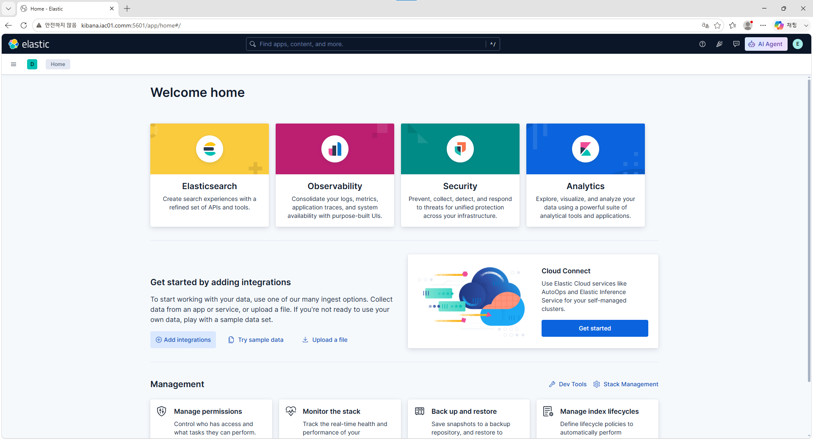
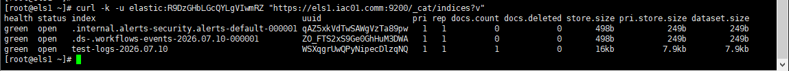

### mTLS 통신 설정 (Filebeat ↔ Logstash ↔ Elasticsearch ↔ Kibana)

- els1의 인증서(crt)를 log1/log2로 scp 전달 후 권한 설정
- `/etc/logstash/conf.d/apache.conf`에 인증서 적용
- Kibana에서 SSL 인증서 발급받아 https 접속 구성
- Logstash beats input에 `ssl_client_authentication => "required"` 설정 — **Filebeat의 클라이언트 인증서를 강제 검증**하도록 구성해, nginx-1/nginx-2/suricata-1 세 소스 모두 실제 mTLS(상호 인증) 구현

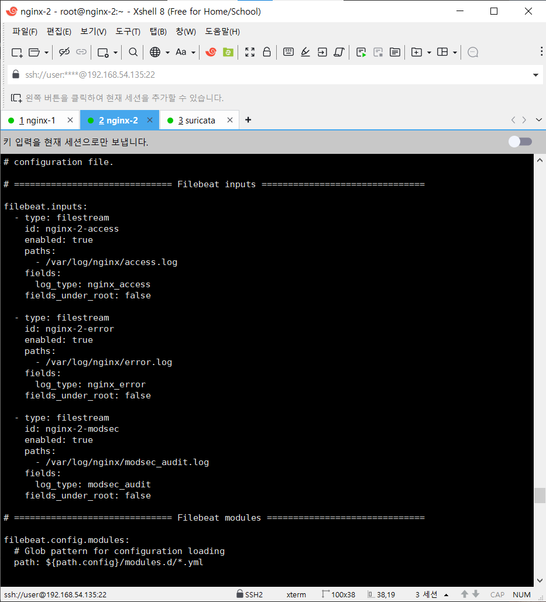
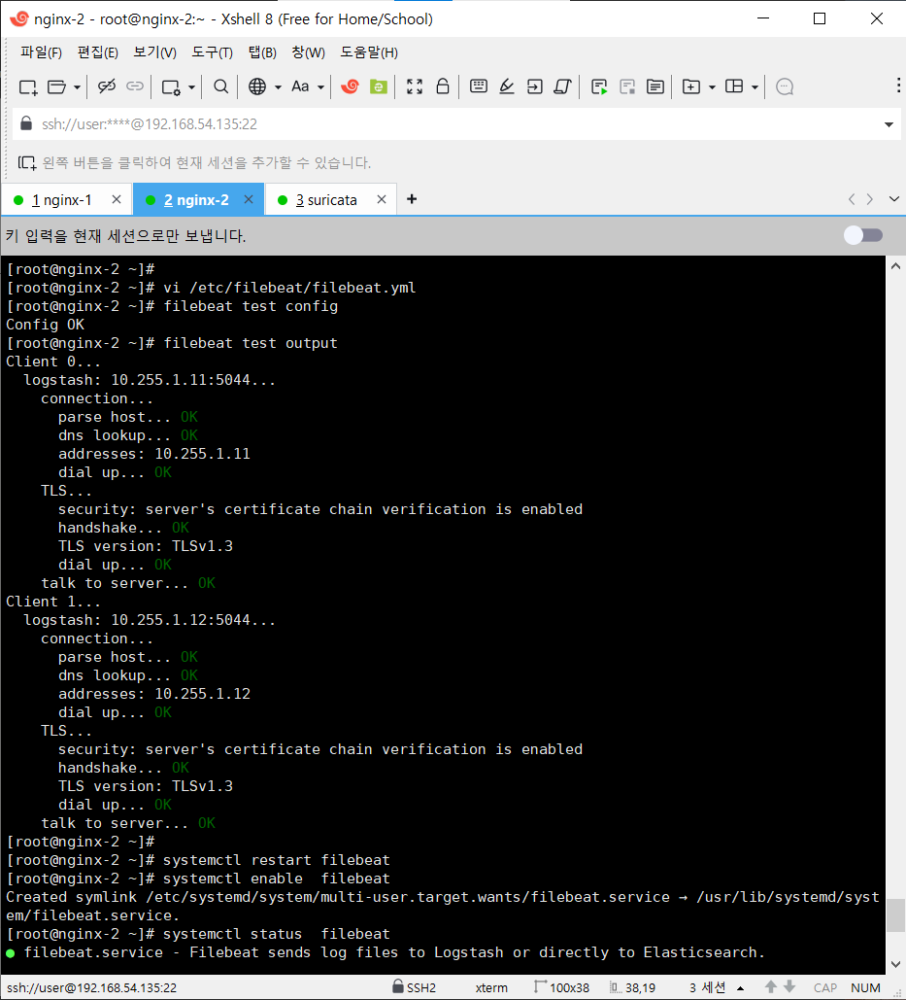
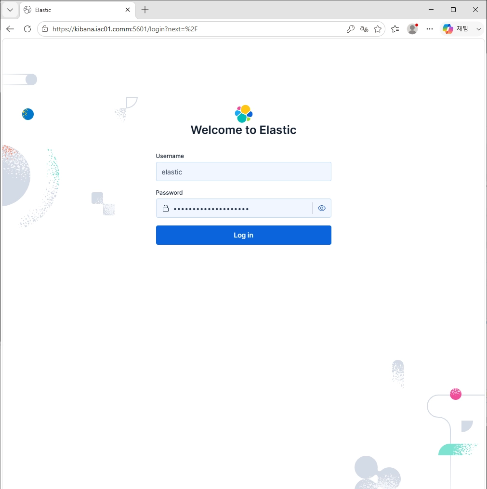

### ILM (Index Lifecycle Management) 정책

로그 인덱스를 시간 경과에 따라 자동 관리하는 기능으로, Hot(최신 데이터) → Warm(조회 빈도 낮음) → Delete(보관기간 만료 시 자동 삭제) 단계로 전환됩니다.

**트러블슈팅**: Elasticsearch 노드가 각 20GB 제한된 디스크만 사용 가능한 랩 환경 제약 때문에, 계획했던 1년 보관 정책을 그대로 적용하면 디스크가 flood-stage watermark를 초과해 클러스터 전체가 read-only로 잠길 위험이 있었습니다. 이를 방지하기 위해 **ILM 정책을 Hot→Warm→Delete가 아닌 Hot→Delete 2단계로 단순화**하고, 보관기간도 1년에서 **7일로 축소**해 적용했습니다.

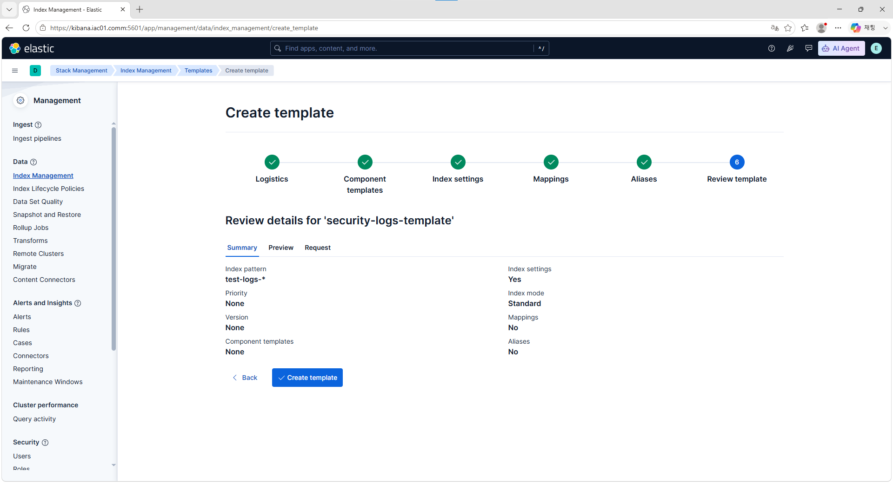

### Kibana 통합 대시보드

AWS 로그는 소스가 많아 계획서상 소스별 개별 인덱스(`logs-waf-*` 등) 대신 **`log-*`로 통합**해서 관리했고, 온프레미스 로그(Suricata/Nginx)는 기존 소스별 인덱스 정책을 유지했습니다.

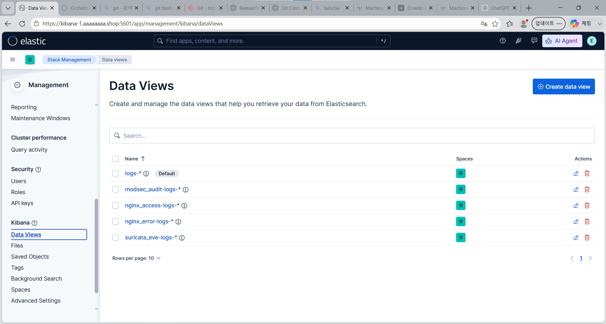
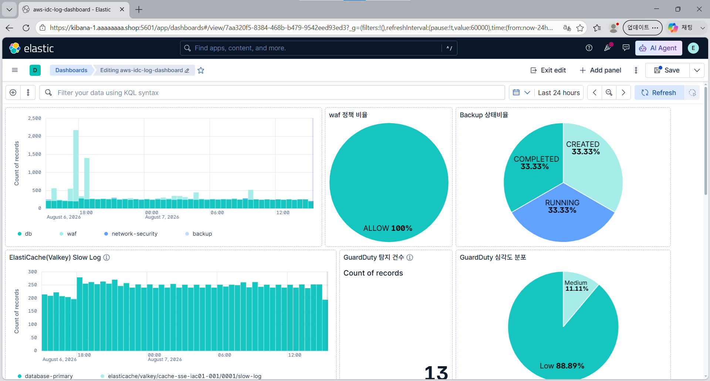
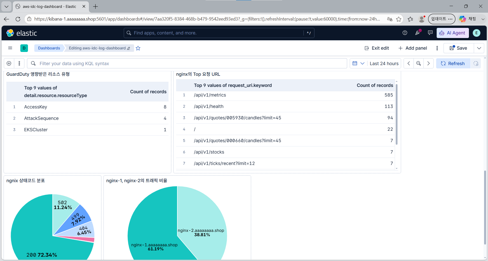

중앙 Kibana 대시보드에서 AWS(WAF/GuardDuty)와 온프레미스(Suricata/NGINX) 로그를 하나의 화면에서 통합 관제하는 것을 확인했습니다.

---

## 트러블슈팅 요약

| 문제 | 해결 |
|---|---|
| CloudWatch → Kinesis 경유 시 WAF/RDS/ElastiCache 로그의 gzip 데이터 손상 | Kinesis를 거치지 않고 Logstash가 VPC Interface Endpoint로 CloudWatch Logs를 직접 폴링하도록 경로 변경 |
| Elasticsearch 노드 디스크 용량 제약(노드당 20GB)으로 1년 보관 정책 적용 시 클러스터 read-only 잠금 위험 | ILM 정책을 Hot→Warm→Delete에서 **Hot→Delete 2단계**로 단순화, 보관기간을 1년 → **7일**로 축소 |

---

## 참고

- 이 문서는 4인 팀 프로젝트의 일부입니다. EKS/컴퓨팅, DB/Failover, WAF, 백업 등 다른 팀원이 담당한 영역은 포함하지 않았습니다.
- 팀 공용 저장소(Mega-study-IaC)는 비공개이며, 이 저장소는 본인이 담당한 부분만 개인 정리한 것입니다.
